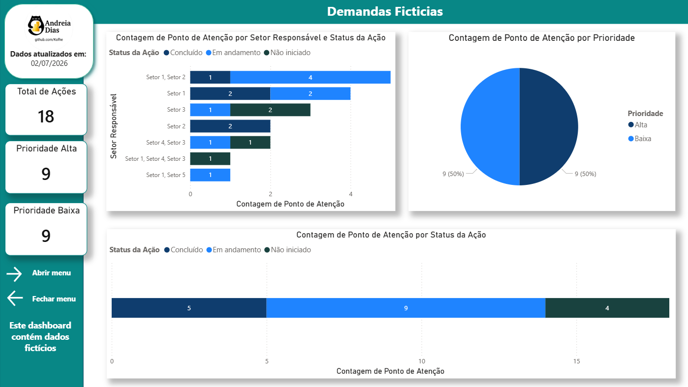
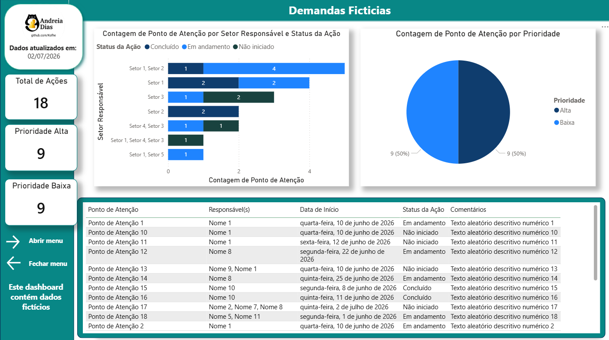

# 📊 Dashboard de Gestão e Acompanhamento de Projetos | Power BI

Este projeto simula um ambiente de gestão e acompanhamento de projetos, com foco na análise do andamento de atividades, status de execução e visão gerencial das demandas.

O objetivo foi construir um dashboard interativo que permita acompanhar desde uma visão executiva até o detalhamento operacional das ações.

---

## 🎯 Objetivo do Projeto
Desenvolver uma solução analítica para acompanhamento de projetos, permitindo:
- Visão do progresso das atividades
- Monitoramento de status das demandas
- Análise de prioridades
- Identificação de gargalos no fluxo de execução
- Apoio à tomada de decisão baseada em dados

---

## 📊 Estrutura do Dashboard

O projeto foi dividido em duas visões integradas:

### 🔹 Dashboard 1 - Visão Geral
Apresenta uma visão executiva do projeto, incluindo:
- Total de ações
- Status geral (Concluído, Em andamento, Não iniciado)
- Distribuição por prioridade
- Análise por setor responsável

---

### 🔹 Dashboard 2 - Análise Detalhada
Apresenta uma visão mais operacional e detalhada, incluindo:
- Registro individual das ações
- Responsáveis por atividade
- Datas de início
- Status detalhado por item
- Comentários descritivos

---

## 🛠️ Ferramentas utilizadas
- Power BI
- Excel (dados fictícios)

---

## 🎥 Demonstração do Projeto

📌 Assista ao vídeo demonstrando a navegação e interação com o dashboard:

👉 https://www.linkedin.com/posts/andreia-tereza-5479002a0_dashboard-de-gest%C3%A3o-e-acompanhamento-de-ugcPost-7478869358040240128-w3jQ/

---

## 📷 Visualizações

### Dashboard 1 - Visão Geral

### Dashboard 2 - Análise Detalhada

---

## 💡 Aprendizados
- Construção de dashboards gerenciais no Power BI
- Estruturação de KPIs para análise de projetos
- Criação de navegação entre páginas (bookmarks)
- Organização de visão executiva e operacional
- Simulação de cenário real de gestão de demandas

---

⚠️ Projeto desenvolvido com dados fictícios para fins de estudo e portfólio.
